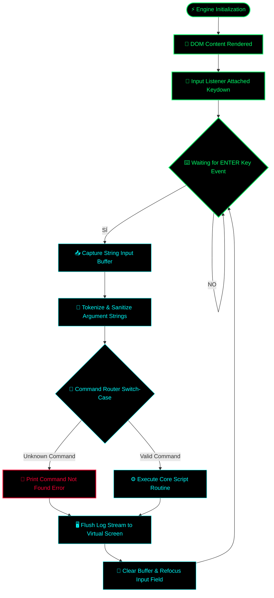

# Web Console Root Engine 🐚

A lightweight, low-latency browser-based terminal simulation engine built in native JavaScript. This repository demonstrates optimized DOM manipulation and real-time command-line input parsing to emulate a sandboxed system shell environment with zero input lag.

## 🗂️ Architectural Overview

The engine acts as a localized text-based interface, capturing user keystrokes, decoupling arguments, and processing system directives through a modular switch-case execution architecture.

### ⚙️ Core Technical Features:
* **Asynchronous Command Parsing:** Processes inputs and string tokens instantly via isolated runtime routines.
* **Low-Latency DOM Rendering:** Minimizes browser reflows and repaints during high-volume log execution.
* **Zero External Dependencies:** Built strictly with vanilla JavaScript, CSS, and HTML for direct hardware thread alignment.

## 🚀 Deployment Instructions

To run the console simulator locally or host it on any web environment:
1. Clone this repository to your local storage.
2. Ensure `index.html`, `style.css`, and `script.js` are in the same directory.
3. Open `index.html` in any standard modern web browser (Chrome, Brave, Edge).

*Developed for sandboxed command execution analysis and core web logic prototyping.*

